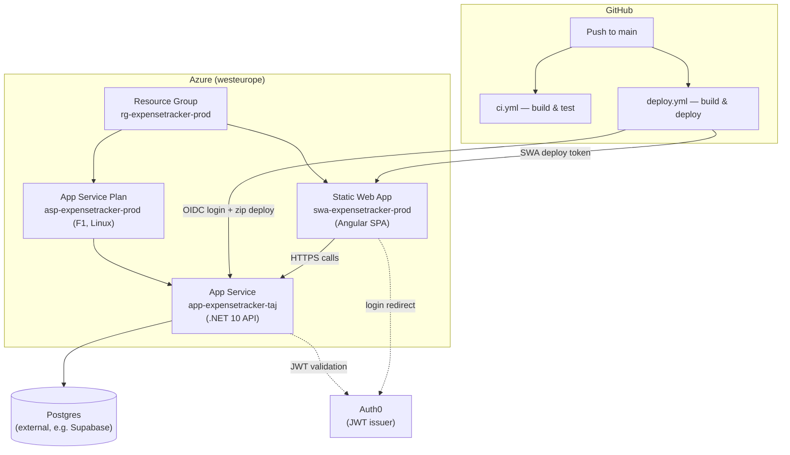

# Azure Hosting & CI/CD

How ExpenseTracker is hosted on Azure, how the infrastructure is provisioned, and how code gets deployed.

## Architecture



- **Terraform** provisions the Azure resources (resource group, plan, App Service, Static Web App) — it does not touch application code.
- **`deploy.yml`** builds and deploys application code into that already-provisioned infrastructure. It does not create or modify Azure resources.
- **Postgres** and **Auth0** are both external to Azure — provisioned/configured manually, referenced by the app via connection string / app settings.

## Terraform (`infra/`)

| File | Purpose |
|---|---|
| `terraform.tf` | Required Terraform version + provider version pin |
| `providers.tf` | `azurerm` provider block |
| `backend.tf` | Remote state config (Azure Storage) |
| `variables.tf` | All inputs — region, SKU, app names, Auth0 domain/audience, DB connection string |
| `main.tf` | The actual resources (resource group, service plan, API web app, static web app) |
| `outputs.tf` | Hostnames + the SWA deployment token (sensitive) |
| `terraform.tfvars.example` | Committed template — copy to `terraform.tfvars` (gitignored) and fill in real values |

### Remote state

State lives in Azure Blob Storage, not locally — so it isn't lost if you run Terraform from a different machine, and it supports locking to prevent concurrent applies. The storage account itself is bootstrapped **outside** Terraform (a Terraform backend can't manage the very storage account it depends on):

```bash
az group create --name rg-expensetracker-tfstate --location eastus
az storage account create --name <globally-unique-name> --resource-group rg-expensetracker-tfstate --sku Standard_LRS --encryption-services blob --min-tls-version TLS1_2
az storage container create --name tfstate --account-name <globally-unique-name>
```

Then fill in that storage account name in `backend.tf`.

### Running Terraform locally

```bash
cd infra
terraform init
terraform plan     # review carefully
terraform apply
```

Secrets (like the Postgres connection string) are supplied via `terraform.tfvars` (gitignored) or `TF_VAR_*` environment variables — never hardcoded into committed `.tf` files. `database_connection_string` is marked `sensitive = true` so it never prints in plan/apply output.

## CI/CD (`.github/workflows/`)

Two separate workflows, deliberately decoupled:

- **`ci.yml`** — runs on every push/PR to `main`. Builds and tests both the .NET API and the Angular client. No deployment.
- **`deploy.yml`** — runs on push to `main` (and can be triggered manually via `workflow_dispatch`). Builds and deploys both apps to the infrastructure Terraform already created.

### Authentication: OIDC, not stored secrets

The API deploy job authenticates to Azure via **federated credentials** (OIDC) instead of a stored client secret:

```bash
az ad app federated-credential create --id <sp-app-id> --parameters '{
  "name": "github-main",
  "issuer": "https://token.actions.githubusercontent.com",
  "subject": "repo:taj485/ExpenseTracker:ref:refs/heads/main",
  "audiences": ["api://AzureADTokenExchange"]
}'
```

GitHub Actions then exchanges a short-lived OIDC token for an Azure access token at runtime — no long-lived secret sitting in GitHub.

### Required GitHub secrets/variables

| Type | Name | Where it comes from |
|---|---|---|
| Secret | `AZURE_CLIENT_ID` | The Service Principal's App ID |
| Secret | `AZURE_TENANT_ID` | Azure AD tenant ID |
| Secret | `AZURE_SUBSCRIPTION_ID` | Target subscription ID |
| Secret | `AZURE_STATIC_WEB_APPS_API_TOKEN` | `terraform output -raw static_web_app_api_key` |
| Variable | `API_APP_NAME` | The App Service name (not secret — it's part of the public hostname anyway) |

## Azure App Service (the API)

- **Plan**: F1 (Free) tier, Linux. Free tier has real constraints: no custom Docker containers (Basic/B1+ required for those), and `always_on` must be `false` (the app idles after inactivity and cold-starts on the next request).
- **Deploy method**: native `.NET` zip-deploy (`dotnet publish` → `azure/webapps-deploy`), not a container — chosen specifically because F1 doesn't support containers.
- **Config**: Auth0 domain/audience and the Postgres connection string are set as App Service **Application Settings** (`Auth0__Domain`, `Auth0__Audience`, `ConnectionStrings__DefaultConnection` — double underscore maps to `:` in .NET config), managed by Terraform, not hardcoded in `appsettings.json`.

## Azure Static Web Apps (the SPA)

- **Tier**: Free.
- **Deploy method**: `Azure/static-web-apps-deploy@v1`, building the Angular app on the GitHub Actions runner and uploading the pre-built output (`Client/dist/expense-tracker/browser`) with `skip_app_build: true`.
